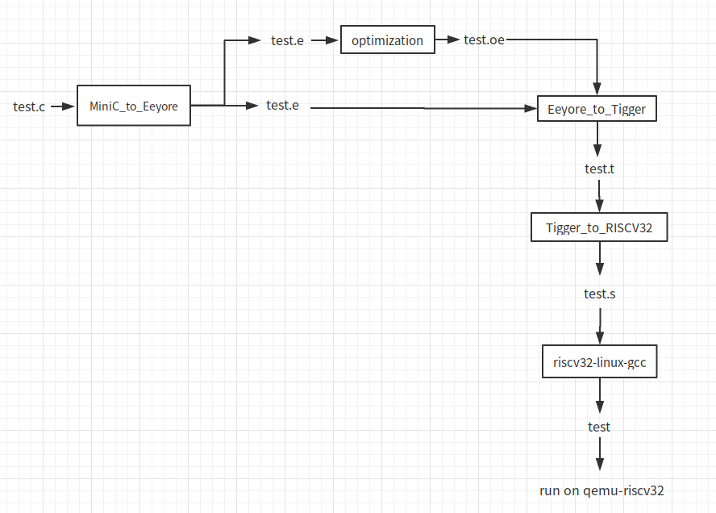

# MiniC 编译实习报告
### 一、 编译器概述
#### 1、 基本功能
* 实现了从符合 MiniC 语法（C 的子集）的程序经过中间代码、优化、寄存器分配等工作生成 RISC-V 汇编代码
#### 2、 使用方法
* 由于编译过程中使用了多次 lex 和 yacc，故而选择 shell 脚本的形式来使整个编译器贯通

* `minic.sh`: 
  * `./minic.sh -h` ： 输出帮助信息

  * `./minic.sh -c [file] -o [file]` ： 从 MiniC 生成 RISC-V 汇编，例如： `./minic.sh -c ./test.c -o ./test.s`
  * `./minic.sh -c [file] -o [file] -O`  ： 经过优化过程再生成 RISC-V 汇编，例如： `./minic.sh -c ./test.c -o ./test.s -O`
  * 测试用例： `06_add.c` `11_if_else.c` `21_arr_sum.c`
  * 若需查看生成的中间代码，则进入每个文件夹中，按 Minic -> Eeyore ( -> optimize ) -> Tigger -> RISCV32 的顺序生成中间代码
* lib 和 lib32 目录下有本地实现的包含 `getint()` 和 `putint()`函数的库文件，可用于本地链接进可执行文件中，保证整个过程的连续性，其中 lib 中为64位， lib32 中为32位
#### 3、 该编译器特点
* 从 MiniC 到 Eeyore 到 Tigger 到 RISC-V代码的逐步生成

* 支持针对 Eeyore 代码的优化
### 二、 编译器设计
#### 1、 概要设计
* 基于 lex 和 yacc 的词法、语法分析，首先扫描 c 文件生成 Eeyore 代码，再扫描 Eeyore 代码通过线性扫描寄存器分配算法生成 Tigger 代码，最后扫描 Tigger 代码生成 RISC-V 代码，同时支持针对 Eeyore 代码的优化生成优化后的 Eeyore 代码


* 整个编译器均使用 c 实现
#### 2、 详细设计
* **生成三地址码**： 在对 MiniC 代码的解析阶段，使用 lex 和 yacc 构建了该程序的一个完整的**树**结构，然后针对整棵树按序进行遍历和代码生成，如对于表达式需要**递归**至树的叶子结点再逐步返回，在返回的过程中分配临时变量和产生中间表达式

* **符号表**： 在符号表的设计中，区分了函数名、全局变量和局部变量，针对局部变量会生成类似 函数名-变量名 的符号表，保证每个变量的作用域符合 C 的语法标准

* **寄存器分配**： 在寄存器分配的过程中，实现了线性扫描寄存器分配算法，该算法的特点是时间复杂度低而且生成的代码的执行效率较好，且易于实现，故而选择该算法
* **优化**： 在针对 Eeyore 代码的优化中，实现了常量预计算、常量传播、复制传播等优化
### 三、 编译器实现
#### 工具软件和工具链
* flex 和 bison： flex 和 bison 作为 lex 和 yacc 的实现，是进行词法分析、语法分析、语义分析良好的工具，使用它们能有效快速得基于 BNF 文法生成词法分析和语法分析器，是快速构建编译器的优秀工具

* riscv-linux-gnu-tools： GNU 工具链的 RISC-V 版，包括 gcc g++ ar objdump 等，使用它们能够生成 RISC-V 平台的汇编文件、二进制可执行文件、库文件等，并可以分析 ELF 文件，为构建一个准确的编译器提供模板
* qemu-riscv： qemu 模拟器的 RISC-V 版本，能够在 x86 平台上模拟运行 RISC-V 架构的二进制可执行文件，使用它来验证编译器生成的汇编代码是否准确
#### 各个阶段的实现：
#### 第一部分 MiniC To Eeyore
##### 1. Target
* 实现从符合MiniC（C的子集）语法的程序生成Eeyore格式的中间代码
##### 2. Files
* 该部分实现在 MiniC_to_Eeyore 目录下
* MiniC_to_Eeyore/main.c : 编译器入口
* MiniC_to_Eeyore/typedefine.h : 定义了语法分析和语义分析所需的结构体，包括`TreeNode`、`NodeKind`、`StmtKind`、`ExpKind`等

* MiniC_to_Eeyore/minic.lex : 使用lex规则实现的词法分析器，语法内容与MiniC文档要求的基本一致
* MiniC_to_Eeyore/minic.y : 使用yacc规则实现的语法分析和语义分析器，实现的语法与MiniC文档要求基本一致，实现的BNF文法较MiniC文档中有所拓展
##### 3. 实现思想
1. 在`minic.lex`中实现了对MiniC的语法集的词法分析，包括整型数、变量、函数名、int、if、else、while、return等，以及数学运算、布尔运算、取地址等符号，针对int和标识符还将保存特定的信息。每次yacc中调用`yylex()`将返回一个`token`，以便yacc进行语法分析

2. 在`minic.y`中实现了对MiniC的语法集的语法分析，拓展了MiniC文档中的BNF文法，并构建了一整棵语法树，每个节点都带有其特定的信息，并在语法树构建完成之后开始对整棵语法树进行分析
3. 在`minic.y`的语法树分析中，使用深度优先递归进行分析，并在分析的过程中建立了符号表，使用符号表进行函数代码和原生变量的Eeyore代码生成。使用深度优先的遍历方式可以有效地生成临时变量的Eeyore代码
##### 4. 关键点实现细节
1. 错误信息：lex中遇到`\n`时将记录行数的变量加1，以便出现错误时报告行数
2. 标识符和整型数的处理：在lex中将标识符的字符串和整型数的数值保存下来，通过yylval传递给yacc并保存在语法树的节点中
3. 建立语法树的过程：在yacc的BNF文法解析过程中，给每个产生式都分配一系列结点，并将产生式左边的设为父节点，将产生式的右边的各个元素设为各个子节点，并在`TreeNode`结构体中保存结点的类型信息，对于identifier(标识符)和integer(整型)节点还将保存
4. BNF递归的处理：尽量实现为左递归，避免符号栈层次过高甚至爆栈，更重要地是使规约快速进行，保证建树过程的可控制性
5. 符号表的处理：符号表的结构体(SymTab)中保存了符号的唯一字符串，其对于局部变量和函数参数保存为“函数名-变量名”，对于全局变量和函数名保存为其标识符的字符串；并在SymTab中保存符号的类型，对于整型保存其整数值,对于变量保存其原生变量的序号
6. dfs(深度优先递归)的处理：定义全局变量`state`记录`dfs`过程中当前的状态（全局or局部），以便能准确区分当前的变量名是局部变量还是函数参数还是全局变量；对于`expression`进行递归处理，每向下深入一个结点，便生成一个临时变量保存该结点以下的表达式的值，并在下一层结点返回时得到下一层结点的临时变量序号，保证最终生成的Eeyore代码是准确的

7. 优化：对于identifier和integer结点，直接接入expression的两端结点，减少生成的结点数，便减少了最终生成的Eeyore代码长度
8. 二义性的处理：以`if then if then else`为例，由于yacc是自底向上的语法分析过程，且更倾向于尽早规约，而`if then`和`if then else`在优先级上是一致的，故而yacc每次遇到`else`会选择尽早规约，即与最近的`if then`相匹配，故而此处不对此二义性做特殊处理，而是选择yacc的特性来处理，并在MiniC的书写中保证其的`else`与最近的`if then`匹配
9. 一个测试实例：
```c
//c代码
int a;
int b;
int main(){
	a=10;
	b=20;
	int c;
	c = a + b;
	return c;
}
//Eeyore 代码
var T0
var T1
f_main [0]
    T0 = 10
    T1 = 20
    var T2
    var t0
    t0 = T0 + T1
    T2 = t0
    return T2
end f_main
```
##### 5. 待处理
1. 更完整的报错信息

2. Type Checker
3. 更多可能的保证安全性的优化
4. Extension
#### 第二部分 Eeyore to Tigger
##### 1. Target
* 实现从符合Eeyore（翻译自MiniC）语法的程序生成Tigger格式的中间代码
#### 2. Files
* 该部分实现在 Eeyore_to_Tigger 目录下
* Eeyore_to_Tigger/main.c： 入口函数
* Eeyore_to_Tigger/linear_scan.h： 解析Eeyore代码和生成Tigger代码所需的一些结构体等
* Eeyore_to_Tigger/eeyore.lex： 使用lex规则实现的解析Eeyore代码的词法解析器
* Eeyore_to_Tigger/eeyore.y： 使用yacc规则实现的对Eeyore代码的BNF规则的语法分析和语义分析器

* Eeyore_to_Tigger/gen_tigger.c： 生成tigger代码的实现
##### 3. 实现思想
1. 实现了线性扫描寄存器分配算法，第一次扫描生成符号表，并记录变量的活跃区间，第二次扫描产生Tigger代码
2. 符号表中记录变量的属性和状态，是否是全局的变量，是否已被分配了一个寄存器，是否在栈中
3. 每个函数分配一个保存栈中信息的结构体，保存局部数组和被保存在栈中的局部变量
4. 按顺序扫描Eeyore代码并生成Tigger代码

5. 寄存器分配发生溢出时选择溢出当前正活跃并且结束距离最远的变量（数组变量直接溢出，不用保存在栈中）
##### 4. 关键点实现细节
1. EeyoreSMT结构体中保存Eeyore语句的类型、行数、变量信息和翻译将要生成的Tigger代码
2. VarTab结构体中保存变量的名字、活跃区间、状态（全局or局部）、是否在寄存器中、是否在栈或者全局位置上

3. FuncStack结构体中保存函数的名字、参数个数、局部数组所需的栈空间大小、溢出所需的栈空间大小以及溢出栈中所保存的变量或寄存器信息
4. eeyore.lex和eeyore.y在对Eeyore代码进行词法分析语法分析之后，将得到的信息保存在EeyoreSMT结构体中，以便用于生成Tigger代码
5. 全局的registers数组保存每个寄存器的分配状态，x0恒为0，不可被分配，t0-t6为调用者保存，s0-s11为被调用者保存，a0-a7为调用者保存，并且为函数调用的传参和返回值寄存器
6. get_variable_interval() 第一遍扫描生成符号表并记录变量的活跃区间
7. gen_tigger_code() 第二遍扫描生成Tigger代码
8. 对于全局变量直接生成代码，并分配全局的id
9.  对于函数名先生成与Eeyore一致的代码，在翻译完整个函数之后获得所需的栈空间大小，再在Tigger代码中加上该参数，同时将传参的局部变量参数和传参寄存器匹配起来
10. 对于局部数组首先在函数栈中分配空间
11. 对于函数中第一次使用的寄存器，若是被调用者保存寄存器，则先将他们保存在栈中，并在栈中记录其所保存的寄存器信息
12. get_a_reg() 获取一个可用寄存器并返回它，可能需要保存寄存器或者溢出寄存器
13. 对于一个等式，包括赋值、运算等，对于不在寄存器中的右值（在栈或全局中）都需要分配寄存器并将它们load进寄存器中；对于不在寄存器中的左值，需要分配寄存器，但是不需要load进来
14. 对于等式右值中的整数，如果为0直接用x0寄存器代替，如果为整数则分配一个寄存器并将该数赋值给该寄存器，使用一次之后便将该寄存器expire
15. 对于数组赋值语句，将数组地址loadaddr进寄存器中，然后将该寄存器加上偏移地址，使用reg[0]的模式来索引具体的元素
16. 对于return语句，将a0寄存器置为return之后的值，并将被调用者保存的寄存器pop出栈
17. 对于param语句，依次将其后的值赋值给传参寄存器
18. 对于call语句，首先保存非使用的传参寄存器之外的已分配的调用者保存寄存器，在函数调用之后，将a0寄存器的值赋值给左值变量所保存的寄存器
19. 每翻译完一句Eeyore代码之后，便将已经不在活跃区间的寄存器expire掉
20. 在获取可用寄存器的过程中，发生spill之后，将当前活跃区间最远的变量溢出到栈中
21. 一个测试实例：
```c
//Eeyore 代码
var T0
var T1
f_main [0]
    T0 = 10
    T1 = 20
    var T2
    var t0
    t0 = T0 + T1
    T2 = t0
    return T2
end f_main
//Tigger 代码
v0 = 0
v1 = 0
f_main [0] [1]
    t0 = 10
    loadaddr v0 t1
    t1[0] = t0
    t1 = 20
    loadaddr v1 t2
    t2[0] = t1
    load v1 t1
    t2 = t0 + t1
    t0 = t2
    a0 = t0
return
end f_main
```
##### 5. 待处理
* 基本块之间的寄存器不可延续

* param之后的a0可能被spill
#### 第三部分 Tigger to RISCV32
##### 1. Target
* 实现从 Tigger 代码生成 riscv32 格式的汇编代码

* 生成的汇编可以通过 riscv32-linux-gcc 工具链接生成 RISCV 二进制可执行文件
##### 2. Files
* 该部分实现在 Tigger_to_RISCV32 目录下
* Tigger_to_RISCV32/main.c： 入口函数

* Tigger_to_RISCV32/typedefines.h： 解析 Tigger 所需的头文件
* Tigger_to_RISCV32/tigger.le： 基于 lex 写的针对 Tigger 代码的词法分析
* Tigger_to_RISCV32/tigger.y： 基于 yacc 写的解析 Tigger 的 BNF 文法并生成 riscv32 汇编
##### 3. 实现思想
* 基于 lex 和 yacc 对 Tigger 代码做词法分析和语法分析

* 由于 Tigger 代码已做完寄存器分配，且寄存器和 riscv 平台的一致，故而只需要对每条语句做模板翻译工作即可
* 具体模板见 MiniC 文档
##### 4. 关键点实现细节
* 在 yacc 的归约过程中边进行模板翻译工作，翻译按函数进行

* 针对每个函数需要计算其栈大小 stacksize
* 针对一些指令可以善用伪指令
* 需要注意32位 riscv 和64位 riscv 的 load/store 操作的区别
* 一个测试实例：
```c
//Tigger 代码
v0 = 0
v1 = 0
f_main [0] [1]
    t0 = 10
    loadaddr v0 t1
    t1[0] = t0
    t1 = 20
    loadaddr v1 t2
    t2[0] = t1
    load v1 t1
    t2 = t0 + t1
    t0 = t2
    a0 = t0
return
end f_main
//riscv32 汇编
	.global	v0
	.section	.sdata
	.align	2
	.type	v0,@object
	.size	v0,4
v0:
	.word	0
	.global	v1
	.section	.sdata
	.align	2
	.type	v1,@object
	.size	v1,4
v1:
	.word	0
	.text
	.align	2
	.global	main
	.type	main,@function
main:
	addi	sp,sp,-16
	sw	ra,12(sp)
	li	t0,10
	lui	t1,%hi(v0)
	add	t1,t1,%lo(v0)
	sw	t0,0(t1)
	li	t1,20
	lui	t2,%hi(v1)
	add	t2,t2,%lo(v1)
	sw	t1,0(t2)
	lui	t1,%hi(v1)
	lw	t1,%lo(v1)(t1)
	add	t2,t0,t1
	mv	t0,t2
	mv	a0,t0
	lw	ra,12(sp)
	addi	sp,sp,16
	jr	ra
	.size	main,.-main
```
#### 第四部分 优化 optimization
##### 1. Target
* 针对 Eeyore 代码进行优化，使生成的代码更加简约，运行效率更高

* 优化后仍然生成 Eeyore 代码
##### 2. Files
* 该部分实现在 optimization 目录下
* optimization/main.c： 入口函数
* optimization/typedefine.h： 优化所需的头文件

* optimization/optimize.c： 具体优化的实现
##### 3. 优化思想
* 基于自己实现的扫描工具，将优化前的 Eeyore 代码扫描存入 `SMT` 结构中

* 对结构体中的代码内容和信息进行多次扫描，进行针对性优化
* 实现的优化有：常量预计算（直接计算出常量运算的值），常量传播（将常量传播给后续的右值中），复制传播（将变量传播给后续的右值，减少变量的数量），删除无用变量 等
* 这些优化都是基于基本块的，并没有实现数据流框架和块间的优化，是基本而保守的优化
##### 4. 实现细节
* `optimize.c`中实现了上述优化过程

* `get_origin_statement()`和`init_smt()`读入并处理了 Eeyore 代码，分类存入 SMT 结构体中
* `begin_optimize()`按函数进行优化
* `do_optimize()`中实现了一些优化，其中`constant_calculation()`对当前函数的每一个常量运算表达式都进行计算，然后将其归类为`ASSIGN`（赋值语句），而非`OP2`
* `do_optimize_block()`按基本块对当前的函数进行块内的优化
* `constant_propagation_block()` 实现了常量传播和复制传播
* `reverse_propagation_block()` 实现了与复制传播相似的优化，但是其`ASSIGN`语句在后，其目的还是为了减少中间变量的生成，
* `remove_unused_t()` 删去了优化后未再被使用的中间变量和无效的语句，使代码的长度进一步缩短
* 一个优化样例如下：
```c
//c代码
int a;
int b;
int main(){
	a=10;
	b=20;
	int c;
	c = a + b;
	return c;
}
//优化前 Eeyore 代码
var T0
var T1
f_main [0]
    T0 = 10
    T1 = 20
    var T2
    var t0
    t0 = T0 + T1
    T2 = t0
    return T2
end f_main
//优化后 Eeyore 代码
var T0
var T1
f_main [0]
    T0 = 10
    T1 = 20
    var T2
    T2 = 30
    return 30
end f_main
```
* 可以看到，优化还是有明显效果的，优化中并没有将原生变量优化掉，这样做的考虑是一方面是为了保守，另一方面是为了与原来的 c 代码有较强的对应关系

* 后续更进一步的优化中可以考虑将原生变量也优化掉，也可以增加数据流框架进来
### 四、 实习总结
#### 1、 收获与体会
1. 主要的收获与体会：
   * 实现编译器是一个复杂而繁琐的工作，需要细致而精心的设计和实现

   * 主要的收获便是理论与实践的结合，使得我对于编译原理和编译的过程有了非常细致的了解，为以后可能从事相关工作作好了铺垫
   * 揭开了我心中对于编译器的一层迷雾，克服了心中对于编译器的畏惧感，为以后写出更好更快的代码也提供了很大的帮助
   * 提升了个人的代码编写能力，设计结构和具体代码书写的结合使得编程能力有了进一步的提升
2. 学习过程的难点：
   * 首先便是寄存器分配过程中遇到的诸多困难，算法的选择和实际的分配，以及对于遇到的各种情况的分类讨论，繁琐而易错，或许选择图染色算法会更加合适一些，之后可以尝试实现一下

   * 然后是在优化过程中遇到的困难，保守的优化总是简单而有效的，但是想要做更进一步的优化却十分困难，遇到的情况也各有不同
   * 拓展语法的过程也十分困难，现代编译器确实是个庞大而复杂的工作
#### 2、 对过程的建议
* 个人认为从 MiniC 到 RISC-V 的课程设置很合理， c 语法简洁而高效，RISC-V 体系架构新颖而开源

* 更希望能更重点提醒一下可能遇到的困难点，比如寄存器分配，可以做好心理准备，预留更多的时间来实现和调试